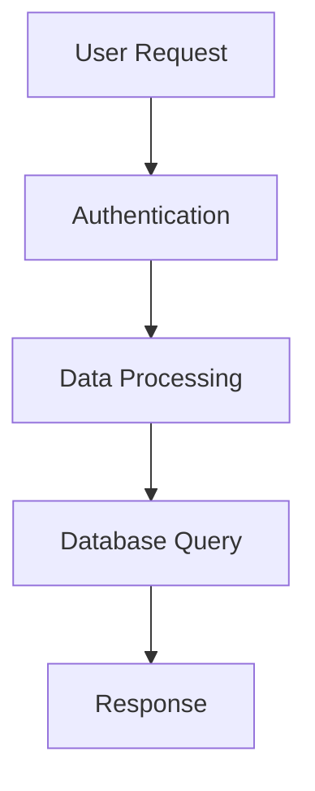

# Use GitHub Copilot to Supercharge Your Coding in VS Code


## James Gress
_Advanced Technology Center AI Lead Accenture_


<i class="fa-brands fa-linkedin"></i> LinkedIn: [jamesgress](https://linkedin.com/in/jamesgress/)  
<i class="fa-brands fa-github"></i> GitHub: [jmgress](https://github.com/jmgress)  
<i class="fa-brands fa-x-twitter"></i> X.com: [@jmgress](https://x.com/jmgress)  
<i class="fa-brands fa-meetup"></i> [Tampa Bay Generative AI Meetup](https://www.meetup.com/tampa-bay-generative-ai-meetup/)  

<!-- 
Done 100's of Prototypes
Taken 10 applications to Production ranging from simple RAG to more complex Agentic systems
Specialize in AI in the SDLD or TDLC
-->

---

# **AI-Generated Code: CEO Insights (2025)**

---

## **Current Impact**
- **Satya Nadella (Microsoft)**  
  *“20–30% of the code in our repos today is written by AI.”*  
  **Date:** Apr 29, 2025 (LlamaCon)

- **Sundar Pichai (Google)**  
  *“AI is generating more than 30% of the company’s code.”*  
  **Date:** Apr 2025 (Alphabet Earnings Call)

<!--
Sources:
Satya Nadella: https://www.windowscentral.com/software-apps/ai/satya-nadella-says-30-of-microsofts-code-is-written-by-ai  
Sundar Pichai: https://www.cnbc.com/2025/04/25/google-ceo-sundar-pichai-says-ai-generates-30percent-of-company-code.html  
-->

---

## **Future Projections**
- **Kevin Scott (Microsoft CTO)**  
  *“95% of all code will be AI-generated by 2030.”*  
  **Date:** Apr 2025

- **Mark Zuckerberg (Meta)**  
  *“Within a year, maybe half of development will be done by AI.”*  
  **Date:** Apr 29, 2025 (LlamaCon)

- **Dario Amodei (Anthropic)**  
  *“We’re 3–6 months from AI writing 90% of code.”*  
  **Date:** Mar 12, 2025

<!--
Sources:
Kevin Scott: https://www.windowscentral.com/software-apps/ai/microsoft-cto-predicts-95percent-ai-generated-code-by-2030  
Mark Zuckerberg: https://www.theverge.com/2025/04/29/meta-ceo-mark-zuckerberg-ai-to-write-half-of-code-next-year  
Dario Amodei: https://www.windowscentral.com/software-apps/ai/anthropic-ceo-predicts-ai-writing-90percent-of-code-in-6-months  
-->

---

## **Key Trend**
- Today: **20–30% of production code** is AI-generated.
- Next 12 months: **50%+ expected**.
- By 2030: **95% projected**.

<!--
Summary Sources:
Industry CEO statements from 2025 events and interviews listed above.
-->

---

# **Understanding Copilot's Strengths & Weaknesses**

<style scoped>
.columns {
  display: flex;
  gap: 2rem;
}
.column {
  flex: 1;
}
</style>

<div class="columns">

<div class="column">

## **Copilot Does Best ✅**
- Writing tests and repetitive code
- Debugging and correcting syntax
- Explaining and commenting code
- Generating regular expressions

</div>

<div class="column">

## **Copilot Is Not Designed For ❌**
- Responding to non-coding/technology prompts
- Replacing your expertise and skills

</div>

</div>

## **Remember: You Are In Charge!**
Copilot is a powerful tool at your service, not a replacement for your knowledge.

<!-- Emphasize that developers remain in control and responsible for code quality -->

---

# **Create Thoughtful Prompts**

**Prompt Engineering Best Practices:**

<style scoped>
.columns {
  display: flex;
  gap: 2rem;
}
.column {
  flex: 1;
}
</style>

<div class="columns">

<div class="column">

## **Structure Your Requests**
- **Break down complex tasks** into smaller steps
- **Be specific** about your requirements
- **Provide examples** of inputs/outputs

</div>

<div class="column">

## **Good Practices**
- **Follow coding standards** in your prompts
- **Include context** about your project
- **Specify frameworks/libraries** you're using

</div>

</div>

**Remember:** Clear prompts = better results from Copilot!

<!-- Demo: Show difference between vague vs. specific prompts -->

---

# **Check Copilot's Work**


## **Understanding & Review**
- **Understand suggested code** before implementing it
- **Ask Copilot Chat to explain** if you're unsure
- **Review carefully** for functionality, security, readability

## **Automated Validation**
- **Use automated tests** to verify correctness
- **Run linting tools** for code quality
- **Code scanning** for security vulnerabilities

---

## **Remember: You're Responsible!**
Copilot is powerful but can make mistakes - always validate before shipping.

<!-- Demo: Show code review process and tooling integration -->

---

# **Time for Live Demo! 🚀**

## **Switching to Hands-On Experience**

**What's Next:**
- Live demonstrations, what could go wrong? :)
- Real-world examples in VS Code

**Remaining Slides:**
- Reference material on the demo sequence and for you to reference later

<!-- Transition point: Switch to live VS Code demo -->

---


# **Setting Up GitHub Copilot in VS Code**

## **Quick Setup**

1. **Install Extension**: Search "GitHub Copilot" in Extensions
2. **Sign In**: Command Palette → `GitHub Copilot: Sign In`
3. **Start Coding**: Open any file and begin typing

<!-- Requires active GitHub Copilot subscription -->

---

# **Pop Quiz! 🤔**
# 
**What is Ghost Text? 👻**

<!-- Let audience guess before showing the example -->

---

# **Ghost Text & Code Completion**

## **What You'll See**


**Ghost Text**: Gray suggestions that appear as you type  
**Tab**: Accept the suggestion  
**Escape**: Dismiss the suggestion

<!-- 
Demo tips:
- Show live coding with ghost text appearing
- Demonstrate accepting/rejecting suggestions
- Show how context influences suggestions
-->

---

# **Keyboard Shortcuts**

<style scoped>
table { 
  font-size: 0.75em;
}
</style>

| Action | macOS | Windows/Linux |
|--------|-------|---------------|
| Accept suggestion | `Tab` | `Tab` |
| Dismiss suggestion | `Esc` | `Esc` |
| Next suggestion | `Option + ]` | `Alt + ]` |
| Previous suggestion | `Option + [` | `Alt + [` |
| Trigger suggestion | `Option + \` | `Alt + \` |
| Open Copilot panel | `Ctrl + Return` | `Ctrl + Enter` |

<!-- Reference these shortcuts during live demos -->

---

# **Another Pop Quiz! 🤔**

## **Do you know what these are?**

- **Context Creep** 🌊
- **Context Confusion** 😵‍💫

<!-- Interactive question to engage audience about AI chat problems -->

---

# **Context Creep & Context Confusion**

## **Context Creep**
- Conversations that gradually drift off-topic
- Accumulating irrelevant information over time
- AI gets "distracted" by previous unrelated discussions

## **Context Confusion** 
- AI mixes up different topics/projects in same chat
- Wrong assumptions based on earlier context
- Reduced accuracy and relevance of suggestions

<!-- Explain the problems before showing the solution -->

---

# **Start Fresh Chats**

**Why Start New Chats:**
- Avoid context confusion and prevent topic drift
- Get focused suggestions

**When to Start New:**
- Switching files/projects
- Different programming language
- New feature vs. bug fix
- Code review vs. implementation

**How:** Click "New Chat" or `Cmd/Ctrl + Shift + Alt + L`

<!-- Demo: Show context pollution vs. fresh chat results -->

---

# **Ask Mode - Copilot Chat**

**Access:**
- Chat Panel: `Cmd/Ctrl + Shift + I`
- Inline Chat: `Cmd/Ctrl + I`

**Examples:**
- Explain this code
- Generate unit tests
- How do I run this code?
- What are the options for pip install?

<!-- Show both chat panel and inline chat demos -->

---

# **Chat History Tip ⬆️**

**Did you know?**

Press the **up arrow (↑)** in the chat input to quickly access your previous chat messages!

**Benefits:**
- Quickly repeat or modify previous questions
- No need to retype complex queries
- Navigate through your recent chat history

**Pro Tip:** Use this to iterate on your questions without starting over

<!-- Demo: Show up arrow navigation through chat history -->

---

# **Copilot Chat Actions**

**After Getting a Response, You Can:**

- **📋 Copy** - Copy response to clipboard
- **💾 Insert at Cursor** - Add code at current cursor position
- **📝 Insert in New File** - Create new file with the response
- **💻 Insert in Terminal** - Run command in integrated terminal
- **🔄 Apply in Editor** - Replace/modify existing code

**Pro Tip:** Hover over code blocks in chat responses to see action buttons

<!-- Demo: Show the action buttons that appear with chat responses -->

---

# **Edit Mode - Direct Code Changes**

**Access:**
- Select code + `Cmd/Ctrl + I`
- Type `/edit` in chat or select edit option

**Examples:**
- "Add error handling"
- "Convert to async/await"
- "Add TypeScript types"
- "Refactor this function"

<!-- Demo: Select code, use Cmd+I, show direct edits -->

---

# **Built-in @ Agents**

**Available Agents:**
- `@workspace` - Entire codebase context
- `@vscode` - VS Code specific questions
- `@terminal` - Command line operations
- `@github` - Specifically focused on GitHub platform features and workflows

**Examples:**
- "@workspace find all TODO comments"
- "@vscode how to configure extensions"
- "@terminal run the build script"

<!-- Demo: Show different agents and their capabilities -->

---

# **Agent Mode - Multi-File Tasks**

**Access:**
- Type `@workspace` in chat
- Use agent commands like `@terminal`

**Examples:**
- "@workspace create a new component"
- "@terminal run the tests"
- "@workspace refactor this feature"
- "@workspace add documentation"

<!-- Demo: Show @workspace for complex multi-file operations -->

---

# **Ask vs Edit vs Agent Modes**

<style scoped>
table { 
  font-size: 0.7em;
}
</style>

| Feature | Ask Mode | Edit Mode | Agent Mode |
|---------|----------|-----------|------------|
| **Purpose** | Get information | Modify code directly | Multi-file operations |
| **Access** | `Cmd/Ctrl + Shift + I` | `Cmd/Ctrl + I` | `@workspace` |
| **Scope** | Questions & explanations | Single code selection | Entire project |
| **Output** | Text responses | Code changes | Complex workflows |
| **Best For** | Learning & debugging | Quick fixes | Architecture changes |

**Choose the right mode for your task!**

<!-- Demo: Show all three modes for the same problem -->

---

# **Copilot Instructions File**

**Create:** `.github/copilot-instructions.md`

**Example Content:**
```markdown
- All functions must include JSDoc comments
- Use TypeScript for new files
- Follow company naming conventions
- Always add error handling
- Write unit tests for new functions
```

**Benefits:**
- Team-wide consistency
- Project-specific guidance
- Version controlled instructions

<!-- Demo: Create file and show how it affects suggestions -->

---

# **Settings Locations**

**Personal (User Settings):**
- macOS: `~/Library/Application Support/Code/User/settings.json`
- Windows: `%APPDATA%\Code\User\settings.json`
- Linux: `~/.config/Code/User/settings.json`

**Project (Team Settings):**
- `.vscode/settings.json`

**Access via VS Code:**
- `Cmd/Ctrl + ,` → Open Settings (JSON) icon
- Command Palette → "Preferences: Open User Settings (JSON)"

<!-- Explain difference: User = personal, Project = team-wide -->

---

# **Copilot Prompt Files**

**Create:** `.github/copilot/prompts/[name].md`

**Example:** `.github/copilot/prompts/test-generator.md`
```markdown
# Test Generator Prompt

Generate comprehensive unit tests for the selected function including:
- Happy path scenarios
- Edge cases and error conditions
- Mock external dependencies
- Use Jest testing framework
```

**Usage:** Type `#test-generator` in Copilot Chat

<!-- Demo: Create prompt file and use with # syntax -->

---

# **Prompt File Examples in Action**

## **Code Review Prompt**
`.github/copilot/prompts/code-review.md`
```markdown
# Code Review Assistant
Review the selected code for:
- Security vulnerabilities and best practices
- Performance optimizations
- Code maintainability and readability
- Adherence to project coding standards
```
**Usage:** `#code-review` + select code

## **Architecture Documentation**
`.github/copilot/prompts/arch-docs.md`
```markdown
# Architecture Documentation Generator
Update architecture documentation for:
- System design patterns used
- Component relationships and dependencies
- Data flow and API contracts
- Deployment and scaling considerations
```
**Usage:** `#arch-docs` + select relevant files

<!-- Demo: Show real prompt files solving common development tasks -->

---

# **AI-Readable Documentation**

## **Why Mermaid Diagrams Matter**
- **Visual context** that AI can parse and understand
- **Structured format** that enhances Copilot's comprehension
- **Living documentation** that stays in sync with code

## **Examples AI Can Easily Parse:**



**Best Practices:**
- Use **standardized formats** (Mermaid, PlantUML)
- Include **clear labels** and descriptions
- Keep diagrams **close to relevant code**
- Add **comments explaining relationships**

**Result:** Copilot understands your architecture and suggests better code!

<!-- Demo: Show how diagrams improve Copilot's contextual suggestions -->

---

# **Instructions.md File**

**Create:** `instructions.md` (project root)

**Example Content:**
```markdown
# Project Instructions

## Code Style
- Use camelCase for variables and functions
- Add TypeScript types for all parameters
- Include JSDoc comments for public functions

## Architecture
- Follow MVC pattern
- Keep components under 200 lines
- Use dependency injection for services
```


<!-- Demo: Create instructions.md and show automatic context -->

---

# **Custom Chat Mode**

**Create:** `.github/copilot/chat-modes/[name].md`

**Example:** `.github/copilot/chat-modes/code-reviewer.md`
```markdown
# Code Reviewer Mode

You are an expert code reviewer. Focus on:
- Security vulnerabilities
- Performance optimizations
- Code maintainability
- Best practices adherence

Always provide specific suggestions with examples.
```

**Usage:** `@code-reviewer` in Copilot Chat

<!-- Demo: Create custom mode and use @ syntax -->

---

# **Another Pop Quiz! 🤔**


# **What are Sparkles?**


<!-- Let audience guess before revealing the answer -->

---

# **Sparkles Explained ✨**

**Sparkles are visual indicators in VS Code that show:**
- AI-powered suggestions are available
- Copilot can help with the current context
- Interactive features you can click or invoke


<!-- Demo: Show sparkles in action and explain when they appear -->

---

# **Custom Instructions**

**Setup:**
- VS Code Settings → GitHub Copilot
- Project-specific `.vscode/settings.json`

**Examples:**
```json
{
  "github.copilot.chat.commitMessageGeneration.instructions": [
    {"text": "Use conventional commit format"}
  ],
  "github.copilot.chat.codeGeneration.instructions": [
    {"text": "Always add TypeScript types"}
  ]
}
```

<!-- Demo: Show settings configuration and behavior changes -->
---

# **Configuring GitHub Copilot in VS Code**

## **VS Code Settings Configuration**


```json
{
    "github.copilot.chat.commitMessageGeneration.instructions": [
        {
            "text": "Changes in the Slides.md it is important to describe the changes in the content and not the technical changes that were done."
        }
    ]
}
```

## **VS Code Settings Location**

```yaml
your-project/
├── .vscode/
│   └── settings.json
└── other-files...
```

<!-- 
Benefits:
- Project-specific AI behavior tailored to your workflow
- Team consistency through shared configuration
- Context-aware assistance for different file types

This configuration ensures Copilot generates commit messages focused on content changes rather than technical implementation details
-->

---

# **Enhancing Copilot with Context**

**Three Ways to Enhance Your Interactions:**

1. **Add Context (#)** - Include files, selections, terminal output
2. **Use Extensions (@)** - Leverage installed VS Code extensions  
3. **Run Commands (/)** - Execute built-in Copilot commands

**Syntax Summary:**
- `#` for context
- `@` for extensions  
- `/` for commands

<!-- Introduction to the three enhancement methods -->

---

# **Adding Context (#)**

**Include Specific Context:**
- `#file:README.md` - Include specific file
- `#file:src/utils.js` - Reference any project file
- `#selection` - Current code selection
- `#terminalLastCommand` - Last terminal output
- `#codebase` - Entire project context

**Benefits:**
- More accurate suggestions
- Relevant code examples
- Better understanding of project structure

<!-- Demo: Show different # context options -->

---

# **Using Extensions (@)**

**Access VS Code Extensions:**
- Install Copilot-compatible extensions
- Access via `@extension-name` syntax
- Extensions appear in autocomplete

**Popular Examples:**
- `@prettier` - Code formatting
- `@eslint` - Linting and fixes
- `@git` - Git operations
- `@npm` - Package management

**Setup:** Extensions must support Copilot integration

<!-- Demo: Show @ syntax with installed extensions -->

---

# **Running Commands (/)**

**Built-in Copilot Commands:**
- `/explain` - Explain selected code
- `/fix` - Fix issues in code
- `/tests` - Generate test cases
- `/doc` - Generate documentation
- `/optimize` - Improve performance
- `/new` - Create new files/features

**Usage:** Type `/` in chat to see all available commands

<!-- Demo: Show / commands and their outputs -->

---

# **Combining Context, Extensions & Commands**

**Fix issues in a specific file:**
```
/fix #file:src/components/Button.js
```

**Generate tests for selected code:**
```
/tests #selection
```

**Explain codebase with workspace context:**
```
@workspace /explain #codebase
```

<!-- Demo: Show complex multi-part requests that actually work -->

---

# **MCP Servers: Connect to External Services**

**Model Context Protocol (MCP)** enables Copilot to connect to external services like GitHub and Jira.

**Popular MCP Servers:**

- GitHub for repositories, issues, PRs
- Atlassian for Jira and Confluence


<!-- MCP servers extend Copilot's capabilities to enterprise systems -->

---

# **Setting Up MCP Servers**

**Setup Process:**

1. **Install MCP server extension** from VS Code marketplace
2. **Configure authentication** (API keys/tokens)

<!-- Proper setup ensures secure and reliable external service integration -->

---

# **Smart Agent Detection vs Explicit # Syntax**

**Copilot Can Auto-Detect Context:**
```text
"Create a bug ticket for the login timeout issue"
"Show me open issues in the frontend repo"
"Update ticket DEV-456 status to In Progress"
```

**Use # for Explicit Control:**
```text
#getJiraIssue 
#editJiraIssue 
```

---

# **MCP Servers in Action: Real Developer Workflows**

**Bug Discovery & Ticket Creation:**
```text
Create a high priority bug ticket in Jira for the login timeout issue in authentication module
```

**Pull Down Issues to Work On:**
```text
Show me all open issues assigned to me in the frontend repository
List my current sprint tasks with status "To Do"
```

**Update Progress & Add Comments:**
```text
Update ticket AUTH-123 status to "In Progress" and add comment "Started investigating timeout configuration"
Add comment to issue #45: "Fixed the validation logic, testing in progress"
```

<!-- MCP servers streamline the entire development lifecycle -->

---

# **Thank You!**


